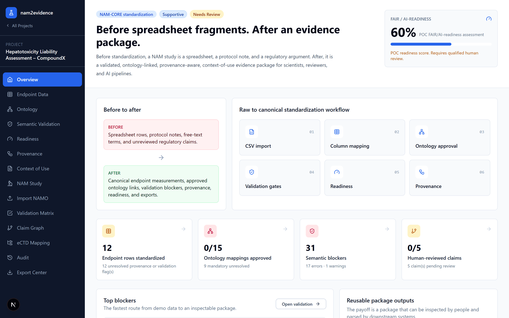
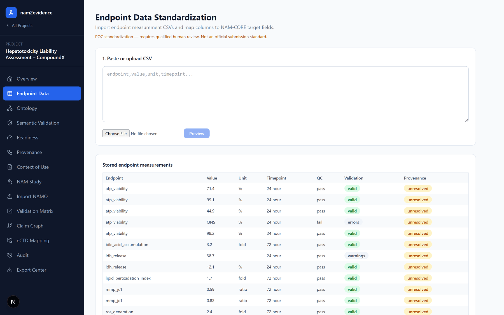
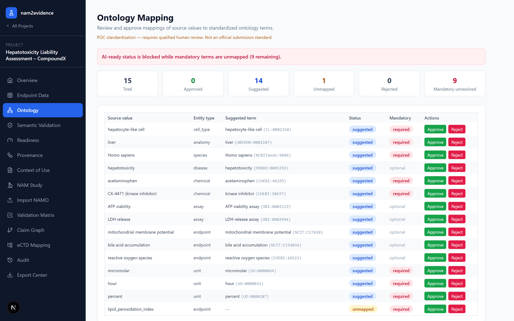
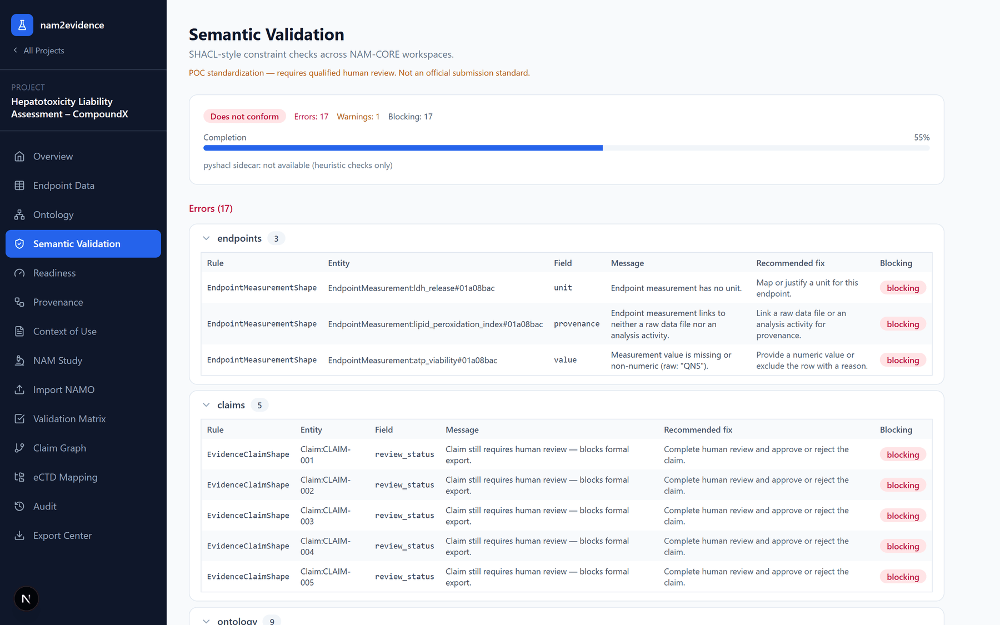
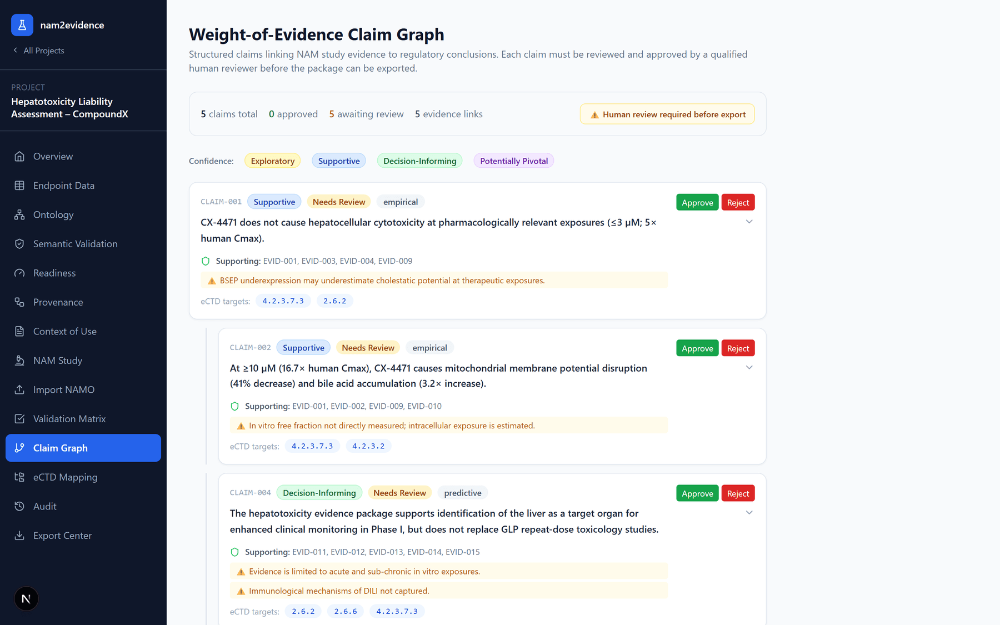
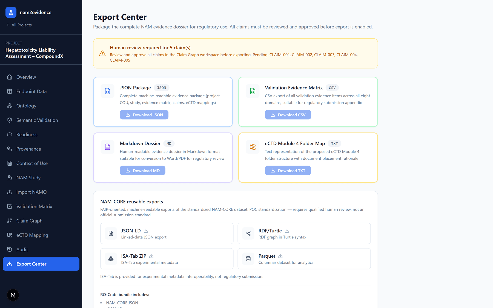
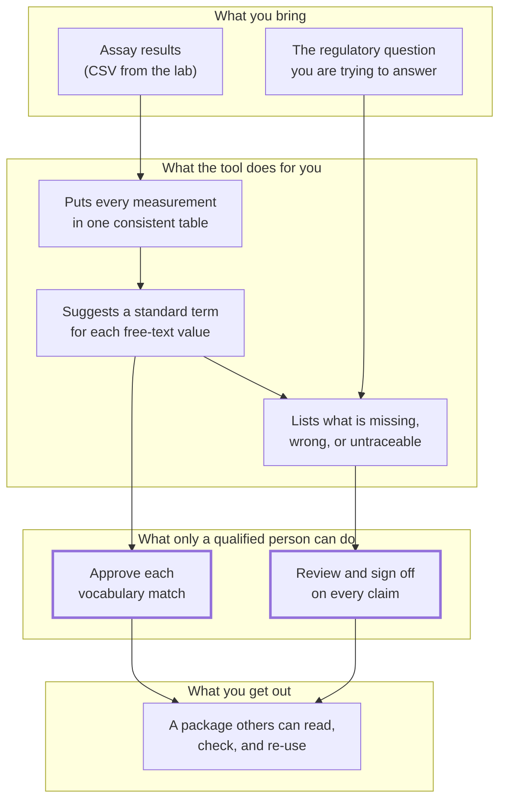

# nam2evidence

**Turn New Approach Methodology (NAM) data into a structured, checkable, shareable
evidence package — with a human in the loop at every step that matters.**



---

## ⚠️ Positioning & disclaimer

> This is a **technical proof-of-concept for standardizing NAM-derived nonclinical
> data.** It does **not** claim FDA acceptance, official SEND/CDISC compliance,
> automatic IND readiness, or NAM validation by software.
>
> It maintains a strict distinction between **data standardization** (what this
> tool does), **scientific validation**, **regulatory interpretation**, and
> **human approval** (which all remain with qualified people). Outputs are a
> **review-supportive structured evidence package** — not a regulatory submission.
> **Qualified human review is required** before any material is used in an IND,
> eCTD, or other filing. See [docs/REGULATORY_POSITIONING.md](docs/REGULATORY_POSITIONING.md).

---

## What this actually does

You ran a NAM study — a liver organoid panel, an organ-on-chip experiment, a QSAR
or PBPK model. You have results, but they live in spreadsheets, protocol notes,
and email threads. Column headers are whatever the instrument wrote. Units are
inconsistent. Nobody outside your lab can tell which number came from which file.

nam2evidence takes that material and turns it into a structured package: every
measurement in a consistent table, every term linked to a shared scientific
vocabulary, every value traceable back to the file it came from, and every
regulatory claim explicitly signed off by a person.

**Concretely, on the built-in demo:**

| Before | After |
| --- | --- |
| A CSV column called `viab` | An `ATP viability` measurement with an explicit unit |
| A cell described as "hepatocyte-like cell" in free text | Linked to `CL:0002310`, reviewed and approved by a person |
| A dose written as `10` | `10 µM`, normalized against `UO:0000064` |
| "The compound looks safe at low doses" in a slide deck | A typed claim, with its supporting evidence listed, that **cannot be exported until a qualified reviewer approves it** |
| No record of who changed what | An append-only audit trail |

The tool will tell you what is still missing — and it will **refuse to produce a
formal package** while blocking issues remain. That is the point, not a bug.

---

## Where to start

**Never used GitHub before? That's fine.** Start with
**[docs/getting-started/never-used-github.rst](docs/getting-started/never-used-github.rst)** —
it explains, in plain language, what this page is and how to get the software onto
your computer.

| If you are… | Start here |
| --- | --- |
| A NAM scientist, toxicologist, or regulatory person who wants to *see* it first | [Screenshots](#see-it-without-installing-anything) below — no installation needed |
| Ready to run it on your own machine, but not a developer | [Start the app without coding](docs/getting-started/non-coder-start.rst) |
| Wanting a guided walkthrough of the demo | [Demo tour](docs/getting-started/demo-tour.rst) |
| Unsure what a word means | [Glossary](docs/glossary.rst) |
| A developer | [For developers](#for-developers) below |

---

## See it without installing anything

These are real screens from the built-in demo project: **CX-4471**, a kinase
inhibitor tested in iPSC-derived liver organoids for hepatotoxicity.

### 1. Your measurements, in one consistent table

Import a CSV, map its columns once, and every reading lands in the same
structure with explicit units.



### 2. Shared vocabulary — proposed by the tool, decided by you

The tool *suggests* an ontology term for each free-text value. It never accepts
one on your behalf. You approve or reject each row.



### 3. A specific list of what is wrong, and how to fix it

Not "validation failed" — the exact record, the exact field, and a recommended
fix for each issue.



### 4. Claims that a person must sign off

Each regulatory claim shows the evidence behind it and its stated limitations.
Nothing leaves as a formal package until a qualified reviewer approves.



### 5. Exports for people and for machines

Human-readable dossiers, plus machine-readable formats other systems can consume.
The review gate is enforced here.



---

## How your data moves through the tool



**The two boxes in "what only a qualified person can do" are exactly the steps
the software will not take for you.** Export of a formal package stays blocked
until both are done.

---

## The workspaces

The left-hand menu has thirteen screens. You do not need them in order, but this
is roughly how the work flows.

| Workspace | What you do there |
| --- | --- |
| **Overview** | See the current state: readiness score, what is blocking, where to go next. |
| **Endpoint Data** | Import CSVs, map columns, normalize units into one canonical measurement table. |
| **Ontology** | Approve or reject the suggested standard term for each value. |
| **Semantic Validation** | Read every outstanding problem, grouped by where it lives. |
| **Readiness** | A 10-dimension FAIR / AI-readiness assessment of the package. |
| **Provenance** | Check that each value traces back to a raw file or analysis script. |
| **Context of Use** | State the regulatory question, intended use, limitations, and acceptance criteria. |
| **NAM Study** | Describe the model system, design, and assay metadata. |
| **Import NAMO** | Bring in an existing NAMO-formatted study record. |
| **Validation Matrix** | Record fitness-for-purpose evidence across eight domains. |
| **Claim Graph** | Write typed claims, link their evidence, and gate them behind human review. |
| **eCTD Mapping** | Map evidence and claims to eCTD nonclinical sections, with justification. |
| **Audit** | Read the append-only log of what changed. |
| **Export Center** | Download the package, once the review gates allow it. |

> In regulatory terms, Context of Use, NAM Study, Validation Matrix, Claim Graph,
> and eCTD Mapping are the original evidence-packaging layer. Endpoint Data,
> Ontology, Semantic Validation, Readiness, Provenance, and Audit are the newer
> **NAM-CORE v0.1** standardization layer underneath them.

---

## Regulatory support levels

Every Context of Use carries one of four deliberately conservative levels:

| Level | Meaning |
| --- | --- |
| **Exploratory** | Hypothesis-generating; not sufficient for regulatory decisions alone. |
| **Supportive** | Adds weight to a body of evidence; suitable for IND narrative context. |
| **Decision-informing** | Sufficient to inform specific regulatory decisions in a defined COU. |
| **Potentially pivotal** | Could replace a traditional study in a specific COU with regulator agreement. |

---

## Demo data: COU-HEP-001 — Liver Organoid Hepatotoxicity

- **COU-HEP-001** — hepatocellular toxicity assessment of a kinase inhibitor
  (CX-4471) using iPSC-derived liver organoids at the IND-enabling stage.
- **NAM-STUDY-001** — 7-concentration response, 5 primary endpoints (ATP
  viability, LDH, MMP, bile-acid accumulation, ROS), 3 donor lines.
- **EVID-MATRIX-001** — evidence items across all eight validation domains.
- **CLAIM-GRAPH-001** — hierarchical claims (exploratory → decision-informing).
- **ECTD-MAP-001** — document mappings targeting 4.2.3.7.3, 4.2.3.2, 2.6.6, 2.6.2.
- **NAM-CORE inputs** — `demo/endpoint_measurements_raw.csv`,
  `demo/exposure_design.csv`, `demo/sample_sheet.csv` (with deliberate gaps).

The demo **deliberately ships broken**: a missing endpoint unit, a non-numeric
value, an unmapped endpoint, a missing donor passage, missing provenance, and
five unreviewed claims. That is so you can watch the tool block an export, then
watch the blockers clear as you fix them. To load the already-fixed state
instead, add `--corrected` (see [Quick start](#quick-start-docker-compose)).

Full narrative with commands and expected outputs:
[docs/POC_DEMO_SCRIPT.md](docs/POC_DEMO_SCRIPT.md).

---

## Documentation

The user-facing Sphinx documentation lives in `docs/`. To build it locally:

```bash
python -m pip install -r docs/requirements.txt
python -m sphinx -b html docs docs/_build/html
```

Open `docs/_build/html/index.html` after the build completes.

| Doc | Contents |
| --- | --- |
| [docs/getting-started/never-used-github.rst](docs/getting-started/never-used-github.rst) | What GitHub is and how to get this software, for absolute beginners. |
| [docs/getting-started/non-coder-start.rst](docs/getting-started/non-coder-start.rst) | Running the app without being a developer. |
| [docs/getting-started/demo-tour.rst](docs/getting-started/demo-tour.rst) | Guided walkthrough of the demo project. |
| [docs/glossary.rst](docs/glossary.rst) | Plain-language definitions of the terms used throughout. |
| [docs/NAM_CORE_SCHEMA.md](docs/NAM_CORE_SCHEMA.md) | NAM-CORE v0.1 schema: shared trait, every entity, extension strategy, `EndpointMeasurement` field list. |
| [docs/ONTOLOGY_MAPPING.md](docs/ONTOLOGY_MAPPING.md) | Supported ontologies, mapping workflow, seed vocabulary, endpoints, AI-ready gating. |
| [docs/VALIDATION_RULES.md](docs/VALIDATION_RULES.md) | Structural, SHACL semantic, and QC/review-gate layers; report shape. |
| [docs/EXPORTS.md](docs/EXPORTS.md) | Every export format, endpoint, intended consumer, and disclaimer. |
| [docs/REGULATORY_POSITIONING.md](docs/REGULATORY_POSITIONING.md) | What the tool does and does not do; standardization ≠ validation. |
| [docs/POC_DEMO_SCRIPT.md](docs/POC_DEMO_SCRIPT.md) | Step-by-step before/after demo narrative with expected outputs. |
| [CHANGELOG.md](CHANGELOG.md) | Summary of the NAM-CORE layer: new entities, endpoints, screens, run/test steps, limitations. |
| [docs/development/](docs/development/) | Engineering notes: design brief, phased implementation plan, and roadmap. |

---

## Open Source

nam2evidence is public open source software licensed under the GNU General
Public License v3.0 or later (`GPL-3.0-or-later`). See [LICENSE](LICENSE),
[COPYING](COPYING), and [NOTICE](NOTICE).

Contributions are welcome under the same license. See
[CONTRIBUTING.md](CONTRIBUTING.md), [CODE_OF_CONDUCT.md](CODE_OF_CONDUCT.md),
[SECURITY.md](SECURITY.md), and [SUPPORT.md](SUPPORT.md).

---

## Disclaimer

All outputs are for **internal evidence organisation and standardization purposes
only**. They do not constitute a regulatory submission, regulatory advice, or a
guarantee of acceptance by any regulatory authority. Human review by qualified
regulatory professionals is required before any material is included in an IND,
eCTD, or other regulatory filing.

---
---

# For developers

Everything below is the technical reference. If you came here to *use* the tool
rather than change it, you can stop reading — [Where to start](#where-to-start)
has what you need.

## Architecture

```
┌──────────────────────┐   REST/JSON   ┌───────────────────────────┐
│  Next.js frontend     │ ────────────▶ │  Symfony 7 + API Platform  │
│  (App Router, TS,     │              │  (PHP 8.4, Doctrine, ULID)  │
│   Tailwind)           │ ◀──────────── │  /api  +  /api/v1/...        │
└──────────────────────┘              └───────┬──────────────┬──────┘
                                              │              │ (optional)
                                   ┌──────────▼──────┐  ┌────▼───────────────┐
                                   │  PostgreSQL 16   │  │ Validator sidecar   │
                                   │  (explicit cols; │  │ services/validator  │
                                   │   JSONB for      │  │ pyshacl + rdflib     │
                                   │   extensions)    │  │ + pyarrow (Parquet)  │
                                   └──────────────────┘  └─────────────────────┘

standards/   → SHACL shapes (nam-core-v0.1.ttl), JSON-LD context, seed vocabulary
```

The validator sidecar is optional; the API validates in-process (PHP-native) and
falls back to CSV when the Parquet engine is absent.

---

## Quick start (Docker Compose)

Install [Castor](https://castor.jolicode.com/) once, then use it to start the
full Docker stack and initialize demo data.

Windows / PowerShell:

```powershell
# Castor's current Windows PHAR requires PHP 8.4.1+.
# This installs PHP 8.4 with winget when available; if winget's PHP manifest is
# stale, it downloads the official PHP 8.4 latest ZIP into %USERPROFILE%\.local\bin.
.\scripts\install-castor.ps1 -InstallPhpWithWinget

# If PHP 8.4.1+ is already installed, this is enough:
.\scripts\install-castor.ps1

# Open a new PowerShell session if PATH was updated, then verify:
castor --version
```

Linux / macOS:

```bash
curl "https://castor.jolicode.com/install" | bash -s -- --static
castor --version
```

Start the application:

```bash
castor start
```

To load the resolved demo state instead:

```bash
castor start --corrected
```

If you do not want to install Castor globally on Windows, the repo-local
PowerShell fallback runs the same Docker flow:

```powershell
.\start.ps1
.\start.ps1 -Corrected
```

The equivalent manual Docker commands are:

```bash
git clone https://github.com/Neuronautix/nam2evidence.git
cd nam2evidence

cp api/.env.example api/.env
cp frontend/.env.example frontend/.env.local   # optional; overrides API URL

# Start all services
docker compose up --build

# Apply database schema (required on first run)
docker compose exec -T api php bin/console doctrine:migrations:migrate --no-interaction

# Load the canonical demo project + ontology seed + NAM-CORE standardization layer
docker compose exec -T api php bin/console app:load-demo-data --force
docker compose exec -T api php bin/console app:load-ontology-seed
docker compose exec -T api php bin/console app:load-namcore-demo          # endpoints, ontology mappings, provenance
# add --corrected to load the resolved (all-blockers-cleared) state instead
```

> `app:load-namcore-demo` is what populates the six NAM-CORE workspaces
> (Endpoint Data, Ontology, Semantic Validation, Readiness, Provenance, Audit).
> Run it after `app:load-demo-data`; run `app:load-ontology-seed` first so mappings
> can auto-suggest against the seed vocabulary.

If Symfony cache files were created with mixed host/container ownership, clear the
generated cache from inside the container first:

```bash
docker compose exec -T --user root api sh -lc 'rm -rf var/cache/* && php bin/console app:load-demo-data --force'
```

| Service                      | URL                            |
| ---------------------------- | ------------------------------ |
| Frontend (Next.js)           | http://localhost:3000          |
| Backend API                  | http://localhost:8080/api      |
| API documentation            | http://localhost:8080/api/docs |
| Validator sidecar (optional) | http://localhost:8000/health   |

**Port already in use?** If another service on your machine occupies 8080 or
3000, override the host port in a `docker-compose.override.yml` — note that
Compose *merges* `ports` lists, so use `ports: !override` to replace rather than
append. Be aware that `NEXT_PUBLIC_API_URL` is inlined into the frontend at
**build** time, so changing the API port also means rebuilding the frontend image
(or running the Next.js dev server on the host with the new value).

**First-use check:** open http://localhost:8080/api/v1/projects — a fresh
environment returns `[]`.

The frontend runs in API mode by default (`NEXT_PUBLIC_DATA_MODE=api`). It also
ships with bundled demo data and can run standalone with
`NEXT_PUBLIC_DATA_MODE=demo`.

### Environment variables

| File | Purpose |
| --- | --- |
| `api/.env.example` | Symfony env vars (`APP_ENV`, `APP_SECRET`, `DATABASE_URL`, `CORS_ALLOW_ORIGIN`). Optional `VALIDATOR_URL` enables the pyshacl/pyarrow sidecar. |
| `frontend/.env.example` | Next.js env vars (`NEXT_PUBLIC_API_URL`, `NEXT_PUBLIC_DATA_MODE`). |

```bash
# Override APP_SECRET for non-dev use:
APP_SECRET="$(openssl rand -hex 32)" docker compose up -d
```

For hot-reload frontend dev inside Docker, copy
`docker-compose.override.yml.example` to `docker-compose.override.yml`.

---

## Demo workflow (before → after)

The demo takes COU-HEP-001 (CX-4471 / iPSC-derived liver-organoid hepatotoxicity)
from raw, gap-ridden CSVs (`demo/*.csv`) to a standardized, reviewed package:

1. **Import** `demo/endpoint_measurements_raw.csv` → preview & map columns → store.
2. **See blockers**: missing unit, non-numeric value, unmapped endpoint, missing
   donor passage, pending claims, missing provenance.
3. **Approve ontology mappings** (human-in-the-loop).
4. **Resolve blockers** and review the 5 claims.
5. **Generate the readiness report** (POC FAIR/AI-readiness, 10 dimensions).
6. **Export all formats** and inspect the audit trail.

Reload demo data at any time:

```bash
docker compose exec -T api php bin/console app:load-demo-data --force
docker compose exec -T api php bin/console app:load-ontology-seed
docker compose exec -T api php bin/console app:load-namcore-demo   # add --corrected for the resolved state
```

---

## Exports (brief)

Legacy dossier formats (JSON, CSV, Markdown, TXT/eCTD structure) plus NAM-CORE
serializations (JSON-LD, RDF/Turtle, ISA-Tab, Parquet, RO-Crate). Formal packages
(RO-Crate "complete") are subject to the review gate; ISA-Tab is for
interoperability, not submission; Parquet uses the pyarrow sidecar with a CSV
fallback. Details, endpoints, and intended consumers:
[docs/EXPORTS.md](docs/EXPORTS.md).

---

## Validation logic (summary)

Three layers: (A) structural / required-field checks at import;
(B) SHACL semantic validation (`standards/shacl/nam-core-v0.1.ttl`), mirrored by a
PHP-native `SemanticValidator` and optionally double-checked by a `pyshacl`
sidecar; (C) scientific QC + review gates. Reports carry
`{entity, field, rule, recommended_fix, blocking}` so the UI can navigate to each
issue. Full detail: [docs/VALIDATION_RULES.md](docs/VALIDATION_RULES.md).

---

## Run locally (without Docker)

### Frontend (standalone demo)

```bash
npm run install:frontend
npm run dev            # http://localhost:3000  (set NEXT_PUBLIC_DATA_MODE=demo for bundled data)
```

The root `npm` scripts forward to the Next.js app in `frontend/`, so you can run
`npm run dev`, `npm run build`, `npm run lint`, and `npm run typecheck` from the
repository root. If you prefer working inside the frontend folder, the same
commands also work after `cd frontend`.

### Backend

```bash
cd api
composer install
cp .env.example .env   # edit DATABASE_URL
php bin/console doctrine:migrations:migrate
symfony server:start
```

---

## Testing

**Frontend**

```bash
npm run lint
npm run build
npm run typecheck
```

**Backend** — the suite covers unit tests (unit normalizer, endpoint-importer preview,
Turtle/RO-Crate serializers) and integration tests (`NamCoreApiTest`: endpoint import,
ontology approve/reject, semantic validation, readiness, export gate, all export formats,
audit log) alongside the original export tests. Same setup CI uses:

```bash
cd api
composer install
# create + migrate the test database (Doctrine appends the _test suffix in APP_ENV=test)
php bin/console doctrine:database:create --env=test --if-not-exists
php bin/console doctrine:migrations:migrate --env=test --no-interaction
vendor/bin/phpunit                 # runs the full suite (unit + integration)
```

CI (`.github/workflows/ci.yml`) provisions a PostgreSQL service, runs the same
create/migrate/phpunit steps, and builds the frontend on every push to a PR.

---

## Updating the screenshots

The images in `docs/images/` are captured from the running demo at 1440×900,
downscaled to 1800px wide. See
[docs/images/README.md](docs/images/README.md) for the capture procedure.

---

## Project structure

```
nam2evidence/
├── frontend/                  # Next.js application (App Router, TS, Tailwind)
├── api/                       # Symfony 7 + API Platform backend (PHP 8.4)
│   └── src/
│       ├── Entity/NamCore/    # NAM-CORE v0.1 entities
│       ├── Service/NamCore/   # importer, validators, scorer, exporters
│       ├── Controller/V1/     # /api/v1 endpoints
│       └── Command/           # app:load-demo-data, app:load-ontology-seed, app:load-namcore-demo
├── services/validator/        # optional pyshacl + pyarrow sidecar (Flask)
├── standards/                 # SHACL shapes, JSON-LD context, seed vocabulary
├── demo/                      # raw + corrected demo CSVs (with deliberate gaps)
├── docs/                      # documentation (see above)
│   ├── images/                # screenshots used in this README
│   └── development/           # design brief, implementation plan, roadmap
├── CHANGELOG.md               # summary of the NAM-CORE standardization layer
└── docker-compose.yml         # full-stack orchestration
```
